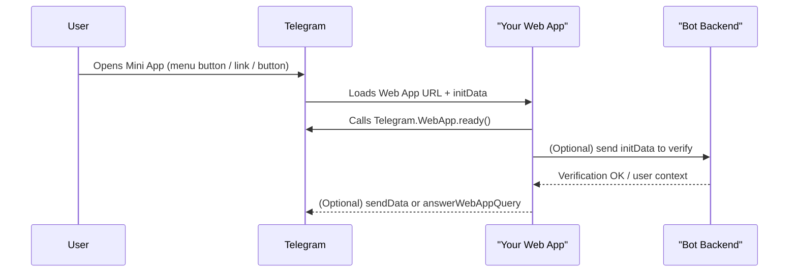
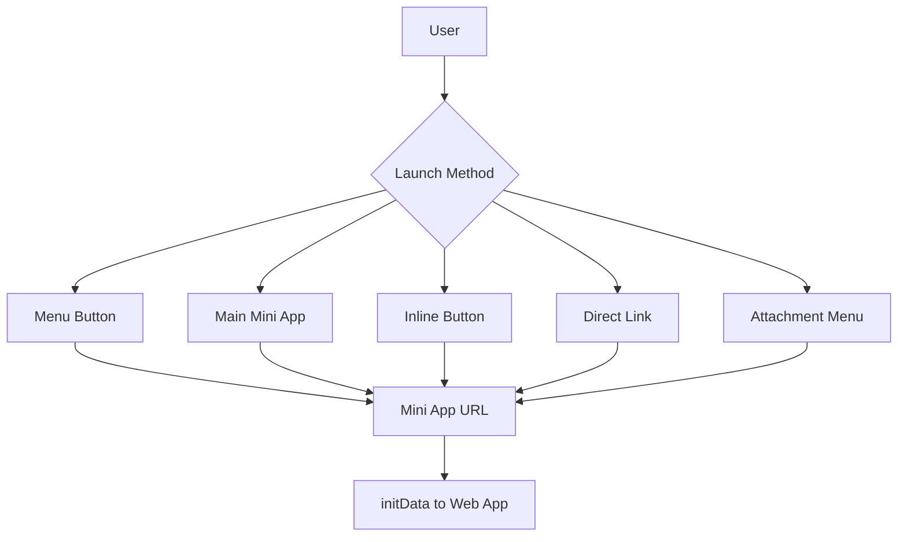

# Telegram Mini Apps: How They Connect to a Bot

This guide explains how a Telegram Mini App (Web App) connects to a bot, how it is launched, and what you need to build and test it. It also includes diagrams and key requirements.

## Short Answer
Yes, you need a bot. The bot is the entry point that launches your Mini App in Telegram. You create a bot with @BotFather, then configure how your app is opened (menu button, main mini app, inline button, direct link, etc.).

## How It Works (Conceptual Flow)

## Launch Methods (How Users Open the Mini App)
Telegram supports several ways to open a Mini App, including:
- Main Mini App from the bot profile
- Keyboard button
- Inline button
- Bot menu button
- Inline mode
- Direct link
- Attachment menu

### 1) Menu Button (simple “open app” inside a chat)
- You configure a custom menu button to launch your Mini App URL.
- This is set in @BotFather (menu button settings).

### 2) Main Mini App (profile “Launch app” button)
- You can set a “Main Mini App” in @BotFather.
- This adds a Launch app button on the bot profile and allows direct link launching.

### 3) Inline Button (web_app button under a bot message)
- Use an inline keyboard button of type `web_app`.
- The Mini App gets a `query_id` so the bot can send a message on behalf of the user using `answerWebAppQuery`.

### 4) Direct Link
- Your main mini app can be opened with a `startapp` link, and `start_param` is passed to your app as data.

### 5) Attachment Menu (advanced)
- Bots can be added to the attachment menu. Availability has restrictions and is fully supported in the test environment.

## Do You Need a Backend?
For a simple learning app, you can run only the frontend. But for real apps, you typically need a backend to:
- Validate `initData` (auth and integrity)
- Handle user data and store state
- Send messages via Bot API methods

Telegram recommends validating Mini App data on your server using the `initData` value.

## Security & Data Validation (Important)
Telegram sends user/session data to the Mini App. You should not blindly trust it.

Key points:
- `Telegram.WebApp.initData` is the raw string meant for validation.
- `Telegram.WebApp.initDataUnsafe` should not be trusted without validation.
- Validate by checking the `hash` against the HMAC computed with your bot token and `WebAppData`.

## What Data You Receive
`initData` can include:
- `query_id` (needed for `answerWebAppQuery`)
- `user` info
- `chat` info (depends on launch mode)
- `start_param` (from links)

## Diagram: Launch Options

## How to Connect Your Existing Next.js App
Your app already includes the Telegram SDK and calls:
- `Telegram.WebApp.ready()`
- `Telegram.WebApp.expand()`

To connect it to a bot in Telegram:
1. Create a bot in @BotFather with `/newbot` to get a token.
2. Deploy your Next.js app to a public URL (e.g. Vercel or any host).
3. In @BotFather, set the Menu Button or Main Mini App URL to your deployed URL.
4. Open the bot in Telegram and tap the menu button or Launch app button.

Optional:
- Use a direct link format with `startapp` parameters for deep linking.

## Typical Cases (Quick Reference)
- **Simple landing/learn app**: Menu button → Mini App URL.
- **App with data back to bot**: Inline button → use `answerWebAppQuery`.
- **Public access**: Main Mini App + direct links with `startapp`.

## What You Do NOT Need
- You do not need a native Telegram app.
- You do not need a special Telegram server.
- You only need a bot + hosted web app + optional backend.

## Summary
- The bot is required as the entry point.
- Telegram launches your web app inside the Telegram client.
- Your app receives `initData` and can optionally talk to your backend.
- You configure launch methods in @BotFather (menu button or main mini app).
